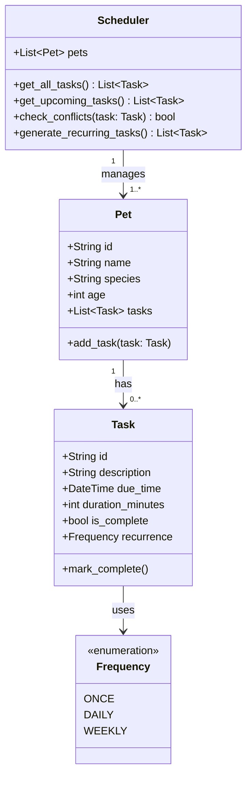

# PawPal+ Class Diagram

```mermaid
classDiagram
    class Task {
        +String id
        +String description
        +DateTime due_time
        +int duration_minutes
        +bool is_complete
        +Frequency recurrence
        +mark_complete()
    }

    class Frequency {
        <<enumeration>>
        ONCE
        DAILY
        WEEKLY
    }

    class Pet {
        +String id
        +String name
        +String species
        +int age
        +List~Task~ tasks
        +add_task(task: Task)
    }

    class Scheduler {
        +List~Pet~ pets
        +get_all_tasks() List~Task~
        +get_upcoming_tasks() List~Task~
        +check_conflicts(task: Task) bool
        +generate_recurring_tasks() List~Task~
    }

    Task --> Frequency : uses
    Pet "1" --> "0..*" Task : has
    Scheduler "1" --> "1..*" Pet : manages
```
